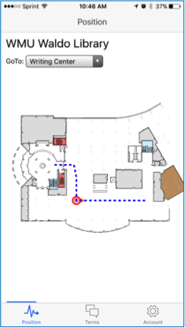
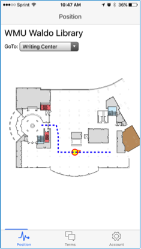
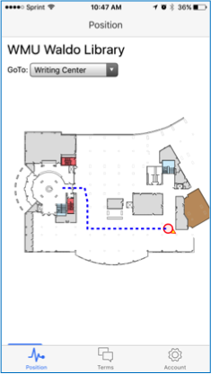

IoT-iBeacons
=====================

This project uses BLE iBeacons and Smartphones' Bluetooth for indoor localization and navigation. The project deployed in [Waldo Library, Western Michigan University](http://www.wmich.edu/library).

We used [Cordova-plugin-ibeacon](https://github.com/petermetz/cordova-plugin-ibeacon) to get the received signal strength indicator (RSSI) of the iBeacons.

## Using the project

The project can be built for iOS or Android using Cordova framework. If you need a quick guide to prepare your device for mobile development using Ionic/Cordova framework please refer to this [document](docs/mobile_app_development_by_cordova.pdf). You need to have at least three physical iBeacons available to run the program.

You need to add the appropriate platform for your target build. 
To add iOS platform, in a console go to the project folder and run 

`ionic platform add ios`

To add Android platform, run:

`ionic platform add android`

Then to build for iOS, in your terminal run:

`ionic build ios`

and to build for android:

`ionic build android`

Here are some screenshots from the navigation of the mobile app:

 
 
 
 

## Notes

* You will need to provide the UUID of your own iBeacons in the *controllers.js* :

     $cordovaBeacon.startRangingBeaconsInRegion($cordovaBeacon.createBeaconRegion("Range Name", your own UUID);
 
* Using the map of your indoor location would need to adjust the coordinates of the iBeacons on the map. 
* Based on the number of your iBeacons and their minor values, the graph of iBeacons should be changed.
